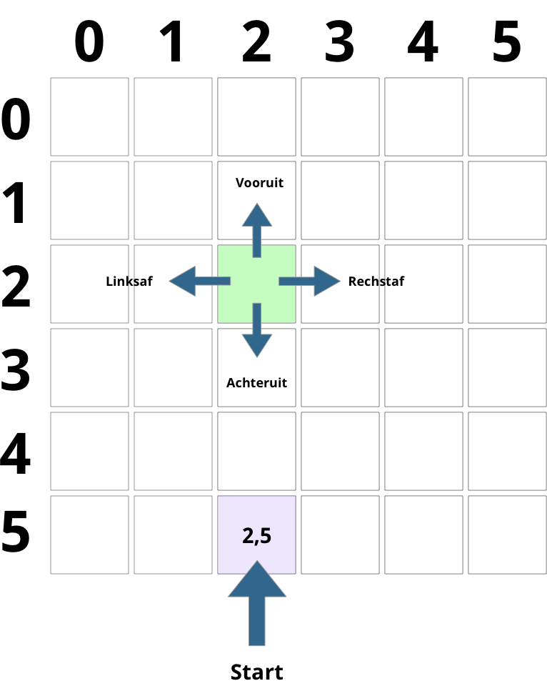

# test module point and click


## matrix

|     | 0   | 1   | 2   | 3   | 4   | 5   |
| --- | --- | --- | --- | --- | --- | --- |
| 0   |     | N   |     |     |     |     |
| 1   | S   |     | W   |     |     |     |
| 2   |     | E   |     | W   | N   |     |
| 3   |     |     | E   |     |     |     |
| 4   |     |     | S   |     |     |     |
| 5   |     |     |     |     | W   |     |


### Navigatie

Handiger om onderaan de matrix te starten, zodat:

- vooruit = op plattegrond naar boven (y wordt kleiner)
- achteruit = op plattegrond naar beneden (y wordt groter)
- links = x wordt kleiner
- rechts = x wordt groter

En dan "onderaan" beginnen bij bijvoorbeeld x=2, y=5.

;

### Data

Te bespreken. We kunnen per positie een object te gebruiken met informatie over dat punt?

```javascript
const plattegrond = [
    [
        {
            title: "Rembrandt", 
            type: "quiz"
            quiz: {// quiz data}
        },
        {
            title: "Rembrandt", 
            type: "sound",
            sound: "bell.mp3"
        },
        {
            title: "Gallery", 
            type: "gallery",
            gallery: ["image1.jpg", "image2.jpg"]
        }
    ]
];
```
